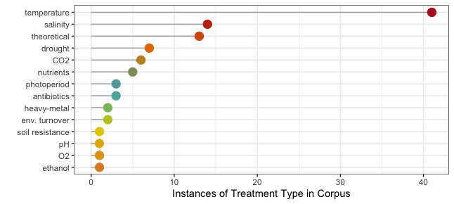
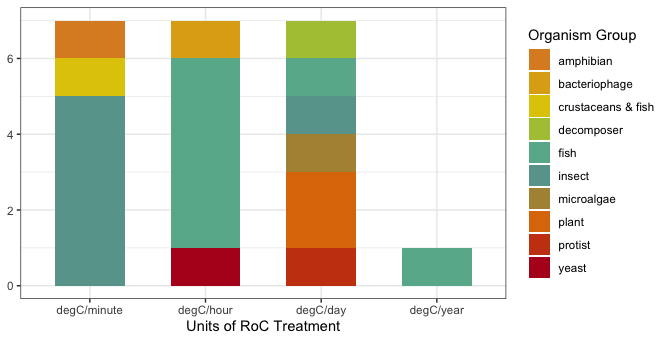

```{r setup, include=FALSE}
knitr::opts_chunk$set(echo = TRUE)
```

## Überblick

Diese Aktivität ist eine Einführung in einige Methoden und R-Packages, die verwendet werden können, um eine "Systematic Review" der Literatur durchzuführen. Wir werden diese Methoden benutzen, um die Literatur über **microbial biospherics** zu untersuchen. Wir werden das von Nakagawa *et al.* (2019) vorgeschlagene "research weaving"-Framework verwenden, das Bibliometrie und systematisches Mapping beinhaltet. Aus ihrem Abstract (Hervorhebung von mir):

> "Research weaving provides a novel framework that **combines bibliometrics and systematic mapping** to inform the development of a field, the influence of research papers and their interconnections, and to visualize content across and within publications."

> "Research weaving has the potential to provide a more efficient, in-depth, and broad synthesis of a research field, to identify **research biases, gaps, and limitations**. Such insights have the potential to inform ecological and environmental **policy** and **communicate research findings to the general public** in more effective ways then are typically done in current research syntheses."

Ihr könnt mehr über das "Research Weaving" erfahren, indem ihr ihren Artikel [hier](https://doi.org/10.1016/j.tree.2018.11.007) lest.

Ihr werdet damit beginnen, eine Forschungsfrage zu entwickeln und dann mit Web of Science [WoS](https://apps.webofknowledge.com/WOS_GeneralSearch_input.do?product=WOS&search_mode=GeneralSearch&SID=D5U7NnnEhob17JVozzU&preferencesSaved=) eine Literaturrecherche durchzuführen. Ihr müsst ein VPN eingerichtet haben, um WoS von zu Hause aus nutzen zu können - wenn ihr das noch nicht getan habt, folgt den Anweisungen der FU-Bibliothek [hier](https://www.zedat.fu-berlin.de/VPN).

Denkt daran, dass eure Gruppe eure Forschungsfrage und den 'Search string' genehmigt bekommen haben muss, bevor ihr fortfahrt! 

Ihr werdet dann die Suchergebnisse als .bib-Datei exportieren. Diese wird verwendet, um eine explorative bibliometrische Analyse mit dem Paket `bibliometrix` durchzuführen (vielleicht erinnert ihr euch daran, wenn ihr das Ökologie Basismodul im Juni belegt habt).

Ihr werdet dann Einschluss-/Ausschlusskriterien entwickeln und die Package `revtools` benutzen, um die Literatur zu screenen.

## Entwickeln einer Forschungsfrage und eines Search string

### 1. Findet ein Thema mit eurer Gruppe

Eure erste Aufgabe ist es, eine Literaturrecherche im Web of Science (WoS) zum Thema **mikrobielle Biosphäre** durchzuführen. Mögliche Themen sind: (1) closed systems ecological research, (2) microbial ecology research using artificial soils, (3) microbial necromass in soil, (4) microbial necromass recycling, and (5) microorganisms and ecosystem stability. Ihr könnt auch ein eigenes Thema vorschlagen, das ihr interessant findet, solange es für die mikrobielle Biosphärenforschung relevant ist. Besprecht dies bitte mit eurer Gruppe und findet ein Thema, das für euch alle interessant ist. 

### 2. Entwickelt eine Forschungsfrage

Dann solltet ihr euch eine Forschungsfrage ausdenken. Diese sollte so allgemein gehalten sein, dass sie durch eine Literaturrecherche beantwortet werden kann. Zum Beispiel: "Welche Erkenntnisse haben wir aus der Forschung mit künstlichen Böden über mikrobielle Ökologie gewonnen?" oder "Welche Themen und Organismen wurden in geschlossenen ökologischen Systemen untersucht?".

### 3. Beginnt die Suche...und entwickelt einen Search string

Euer Ziel ist es, einen Suchbegriff zu erstellen, der *alle* Artikel erfasst, die für euer Forschungsthema relevant sind. Das bedeutet, dass ihr über alle möglichen Begriffe nachdenken solltet, die dasselbe beschreiben könnten, und diese mit einbeziehen solltet. Wenn du eine "echte" bibliometrische Analyse und ein systematisches Mapping durchführst, werden alle relevanten Artikel erfasst - das können Tausende von Artikeln sein. Da wir im Kurs nur ein paar Wochen Zeit haben, solltet ihr euch ein Thema aussuchen, zu dem ihr **100-300 Artikel** findet. Wenn eure WoS-Suche mehr Ergebnisse liefert, solltet ihr den Umfang reduzieren (z.B. indem ihr euch auf ein spezifischeres Thema konzentriert).

Hier sind einige Beispiele für Search strings:

> ("soil organic matter"  OR "soil organic carbon"  OR "organic matter")  AND (decomposition  OR degradation)  AND drought

dieser Search string verwendet Anführungszeichen "", um sicherzustellen, dass nur Artikel mit dem gesamten Ausdruck "soil organic matter" in den Ergebnissen erscheinen. Er verwendet auch mehrere Wörter, z.B. "decomposition" und "degradation", um die gleiche Sache zu beschreiben. Dies erhöht die Chancen, alle relevanten Artikel zu finden.

> (soil  AND necromass AND fung*)

dieser Search string verwendet ein Sternchen *, so dass alle Ergebnisse, die mit 'fung' beginnen, angezeigt werden (z.B. fungi, fungus, fungicide).

Über die Operatoren (z.B. AND oder OR), die ihr für euren Search string verwenden müsst, könnt ihr euch hier belesen.

### 4. Verfeinert die Suche und den Search string

Wenn eure Suche mehr als 300 Ergebnisse liefert, solltet ihr zunächst versuchen, die Anzahl der Ergebnisse zu reduzieren, indem ihr eure Forschungsfrage genauer formuliert. Konzentriere dich zum Beispiel auf eine bestimmte Organismengruppe (z. B. Pilze oder Bakterien). Falls nötig, kannst du die Anzahl der Suchergebnisse weiter reduzieren, indem du die Kategorien "Ergebnisse verfeinern" auf WoS nutzt. So könnt ihr zum Beispiel Artikel ausschließen, wenn ihr euch auf experimentelle Forschung konzentrieren wollt. Wenn ihr weniger als 100 Ergebnisse erhaltet, solltet ihr die Suche ausweiten. Wenn wir (ich und die Tutor/innen) euren Suchbegriff und eure Forschungsfrage überprüfen, können wir euch dabei helfen.

Schreibt auf, was ihr tut! Und denkt daran, diese Entscheidungen werden später beeinflussen, wie ihr eure Ergebnisse interpretiert!

**Wenn ihr euch für ein Thema entschieden habt, muss es von mir genehmigt werden, bevor eure Gruppe weitermacht.**

## Bibliometrics Analyse

Sobald euer Thema genehmigt ist, könnt ihr mit der bibliometrischen Analyse beginnen. 

### 1. Erstelle eine BibTeX-Datei im Web of Science

Eine Anleitung, wie ihr eine BibTeX-Datei (.bib) über WoS erstellen könnt, findet ihr in [diesem Tutorial](https://www.bibliometrix.org/vignettes/Introduction_to_bibliometrix.html). Das Tutorial stammt von den Autoren des Pakets `bibliometrix`, Massimo Aria und Corrado Cuccurullo, und enthält viele Informationen über die verschiedenen verfügbaren Funktionen (Aria & Cuccurullo, 2017). Die Codestücke auf dieser Website stammen aus ihrem Tutorial.

Ich habe auch ein Tutorial-Video aufgenommen, das zeigt, wie man eine Literatursuche im Web of Science durchführt und die Ergebnisse als .bib-Datei exportiert. Dieses ist auf [VBrick](https://fu-berlin.eu.vbrickrev.com/sharevideo/2cb4b6bb-11a1-4b38-8618-705412d5fde3) verfügbar. Folge dem Tutorial euer Wahl und erstellt eure BibTeX-Datei. Achtet darauf, wie ihr die Datei benennt und in welchem Ordner ihr sie speichert!

### 2. Beginnet eure Bibliometrics Analyse

Nun könnt ihr mit der Arbeit in R beginnen. Erstellt ein neues R-Skript für das Projekt. Falls ihr das Package `bibliometrix` noch nicht installiert habt, tut dies bitte jetzt, etwa so: 

```{r eval = FALSE}
install.packages("bibliometrix", dependencies=TRUE)
```

und ladet dann das Package:

```{r message = FALSE}
library(bibliometrix)
```

[Die Dokumentation findet sich hier](https://cran.r-project.org/web/packages/bibliometrix/bibliometrix.pdf).

Sobald ihr eine .bib-Datei erstellt habt, müsst ihr die Daten mit dem Paket `bibliometrix` in R laden und eine bibliometrische Analyse durchführen. Wir beginnen damit, die Daten zu laden und sie in einen bibliometrischen Datenrahmen zu konvertieren. Es kann sein, dass ihr ein paar Minuten warten müsst, bis der bibliometrische Datenrahmen generiert wird... achtet auf die Konsole!

```{r eval = F, message = F}
file <- "your_bibtex_file.bib"

M <- convert2df(file = file, dbsource = "isi", format = "bibtex")
```

Sobald der Data Frame geladen ist, überprüft ihn. Was sind die Spaltennamen?
Tipp: versucht es mit `colnames()`.
Diese 2-Buchstaben-Codes werden 'field tags' genannt und es gibt eine komplette Liste [hier](https://www.bibliometrix.org/documents/Field_Tags_bibliometrix.pdf). Ihr werdet diese später benutzen müssen.

### 3. Eine deskriptive Analyse durchführen

Führe eine deskriptive bibliometrische Analyse durch und drucke eine Zusammenfassung der Ergebnisse mit `biblioAnalysis` und `summary`.

```{r eval = F, message = F}
results <- biblioAnalysis(M, sep = ";")
S <- summary(object = results, k = 10, pause = FALSE)
```

Schaut euch die Ergebnisse der Zusammenfassung in der Konsole an, um einen Eindruck von eurer Artikelsammlung zu bekommen. Welches sind die 5 meistzitierten Artikel in deiner Sammlung? Kopiere ihre DOIs und füge sie bei Web of Science ein, um ihre Abstracts zu lesen - warum glaubt ihr, dass sie hoch zitiert werden? 

```{r include = FALSE}
file <- "/Users/fastloris/Desktop/Desktop/Vertiefungsmodul course materials/WS2021/Praktikum/VM_biblio/soil_necromass_fungi.bib"
M <- convert2df(file = file, dbsource = "isi", format = "bibtex")
results <- biblioAnalysis(M, sep = ";")
S <- summary(object = results, k = 10, pause = FALSE)
```

Ihr könnt schnell den DOI oder das Publikationsjahr (oder jede andere Information im Datenrahmen) anzeigen, indem ihr den Artikel/Zeilennamen und den Field tag angebt, wie hier:

```{r}
M["MILTNER A, 2012, BIOGEOCHEMISTRY", "DI"]
M["MILTNER A, 2012, BIOGEOCHEMISTRY", "PY"]
```

Führe nun die Funktion `plot` aus. Speichere das Diagramm, das die "produktivsten Länder" zeigt.

```{r eval = F, message = F}
plot(x = results, k = 10, pause = FALSE)
```

### 4. Untersuche die Schlüsselwörter und ihre Beziehungen

Schauen wir uns an, wie die Schlüsselwörter in den Artikeln miteinander verbunden sind. Das gibt uns Aufschluss darüber, wie die Unterthemen innerhalb eures Themas miteinander verbunden sind. Gibt es Cluster von Stichwörtern? Welche Ideen sind miteinander verbunden? Was sagt euch das über euer Thema? Verrät dies etwas über die Art und Weise, wie Gruppen von Menschen über dieses Thema denken/studieren?

```{r}
NetMatrix <- biblioNetwork(M, analysis = "co-occurrences", network = "keywords", sep = ";") # dies erstellt das Netzwerk
net=networkPlot(NetMatrix, normalize="association", weighted=T, n = 30, Title = "Keyword Co-occurrences", type = "fruchterman", size=T,edgesize = 5,labelsize=0.7) # Dies zeichnet das Netzwerk auf
```

Ihr könnt auch die Verbindungen zwischen Schlüsselwörtern und Themen mit `conceptualStructure` untersuchen - dies erzeugt vier Darstellungen - seht euch das Topic Dendrogram und Conceptual Structure Map an.

```{r, message=FALSE, warning=FALSE}
CS <- conceptualStructure(M,
                          field="DE", # this chooses keywords for the plot
                          method="MCA",
                          minDegree = 4, # this is the minimum number of occurences of a keyword in the collection to analyze and plot; change this if too few or too many words appear
                          clust= "auto",
                          labelsize=10)
```


### 5. Lokale Zitationsnetzwerke

Wir können lokale Zitationsnetzwerke nutzen, um die Beziehungen zwischen den Artikeln in unserer Sammlung zu untersuchen, z. B. welche Autor/innen oder Artikel in unserer Sammlung häufig von anderen in der Sammlung zitiert wurden. Dazu könnt ihr `localCitations` verwenden.

```{r}
CR <- localCitations(M, sep = ";")
```

Die Ergebnisse werden in `CR` gespeichert, das nun Informationen über die am häufigsten *lokal* zitierten Autor/innen und Artikel in eurer Sammlung enthält. Beachte, dass “LCS” Informationen über *lokale* Zitate (d.h. Zitate innerhalb der Sammlung) liefert und “GCS” Informationen über *globale* Zitate (d.h. die Anzahl der Zitate, die diese/r Autor/in oder Artikel insgesamt hat). Um das besser zu verstehen, sieh dir die Top 3 der lokal zitierten Artikel in `CR` an.

```{r echo = F}
CR$Papers[1:3,]
```

Jetzt lasst uns einen Blick auf die Autor/innen mit den meisten *lokalen* Zitaten aus `CR` werfen. Vergleicht diese Autor/innen mit den Autor/innen der Liste mit den Top 5 *global* zitierten Artikeln eurer deskriptiven Analyse. Sind es die gleichen Autor/innen? Die gleiche Reihenfolge? Warum oder warum nicht?

```{r echo = F}
CR$Authors[1:3,]
```

Jetzt erstellt ein Diagramm der produktivsten Autor/innen über die Zeit. Es zeigt die Autor/innen mit den meisten Publikationen der Sammlung. Kommen irgendwelche von den top lokal zitierten Autor/innen eurer Liste in dem Diagramm vor? Waren sie „Pioniere“ in diesem Gebiet (d.h. frühes Publikationsdatum)? Publizieren sie aktuell aktiv zu dem Thema? In diesem Beispiel ist der einzige Autor C.W. Fernandez, welcher kürzlich vier Publikationen zu unserem Thema veröffentlicht hat.

```{r}
topAU <- authorProdOverTime(M, k = 10, graph = TRUE)
```

### 6. Three fields plot

Schließlich werden wir die Beziehungen zwischen Autor/innen, Schlagwörtern und WoS-Kategorien untersuchen. Ihr könnt jedes beliebige 3-Felder-Schlagwort wählen, das ihr möchtet - es könnte auch interessant sein, Journale (Quellen) oder häufig zitierte Referenzen zu untersuchen. Wir werden dazu einen 'three fields plot' mit der Funktion `threeFieldsPlot` verwenden. Suche in der Hilfe-Suchleiste von R, um mehr über diese Funktion zu erfahren und ein Beispiel für ihre Verwendung zu sehen. Klicke auf eines der Stichwörter oder eine/n Autor/in in der Grafik unten.

```{r echo = FALSE}
threeFieldsPlot(M, fields=c("AU","DE","SC"),n=c(10,10,10))
```

Achte darauf, dass ihr alle Ergebnisse und Diagramme aus dieser Übung speichert. Ihr könnt nun den ersten Teil des Arbeitsblatts für diese Aktivität ausfüllen.

## Systematic Mapping

Im nächsten Teil dieser Aktivität geht es darum, eure Artikel zu screenen und einige Informationen aus ihnen zu extrahieren, um 'Systematic maps' zu erstellen. 

### 1. Einschluss/Ausschluss-Kriterien

Der erste Schritt besteht darin, eure Einschluss-/Ausschlusskriterien zu erstellen. Mit anderen Worten, was sind die Merkmale der Artikel, die ihr überprüfen werdet?

Ihr solltet eure Forschungsfrage überdenken und entscheiden, welche Art von Artikeln und Daten nützlich sind, um eure Frage zu beantworten. Nehme ich meine Suche nach Boden/Nekromasse/Pilzen als Beispiel, könnte ich daran interessiert sein, wie die Pilzvielfalt und -aktivität die Zersetzung oder Stabilisierung von Nekromasse im Boden beeinflusst. Ich würde also nur Artikel einschließen, die sowohl Nekromasse als auch Pilzlebensgemeinschaften (Diversität oder Funktionen) untersuchen. Ich würde Studien ausschließen, die nur Bakterien und keine Pilze untersuchen, oder die nur die Laubstreu, aber nicht die Nekromasse untersuchen. Ich würde auch alle Artikel ausschließen, die nicht über Ergebnisse aus experimenteller Forschung berichten (z. B. Übersichtsartikel).

Achtet darauf, dass ihr eure Ein- und Ausschlusskriterien aufschreibt!! Dies ist sehr wichtig für die Reproduzierbarkeit.

### 2. Aufteilung der Artikel

Nun zurück zu R, aber nicht für lange! Wir werden `revtools` benutzen, um die Abstracts zu screenen.
Ladet das revtools-Package und eure BibTeX-Datei:

```{r}
library(revtools)
```

```{r eval = FALSE}
recs <- read_bibliography("soil_necromass_fungi.bib")
```

Nun werdet ihr die Artikel mit der Funktion `allocate_effort` auf die Gruppenmitglieder aufteilen. Damit kann man die Anteile der Artikel pro Person bestimmen. Um eine robuste Systematic review zu haben, ist es notwendig, dass einige der Artikel von mehr als einer Person gescreent werden. In diesem Beispiel werden 19% der Artikel von mehr als einer Person gescreent (diese Funktion versucht, so nah wie möglich an den Anteil heranzukommen, den ihr in 'proportion_checked' gewählt habt). Auf diese Weise könnt ihr später sicherstellen, dass jeder die Einschluss-/Ausschlusskriterien auf die gleiche Weise anwendet.

```{r}
alleff <- allocate_effort(reviewers = c("India", "GroupMember1", "GroupMember2"), effort = c(0.33,0.34,0.33), proportion_checked = 0.2, quiet = FALSE)
```

```{r eval = FALSE}
distribute_tasks(recs, alleff)
```

Ein wenig R-Magie ist hinter den Kulissen passiert, als ihr die zweite Code-Zeile ausgeführt habt. Werft einen Blick in euer Arbeitsverzeichnis (oder in den Tab "Dateien" in RStudio). Ihr solltet feststellen, dass es jetzt für jedes Mitglied eurer Gruppe eine .csv-Datei gibt! **Ein Gruppenmitglied sollte alle Dateien, die in diesem Schritt erstellt wurden, an die anderen Gruppenmitglieder senden** (sonst habt ihr alle eine zufällige Auswahl an Dateien und könnt nicht alle Abstracts durchsehen)!

### 3. Abstract-Screening

Jetzt seid ihr bereit, mit dem Screening der Abstracts zu beginnen. Wenn R euch stresst, könnt ihr euch jetzt freuen: ihr werdet nicht mehr lange in RStudio sein. Jetzt dürft ihr das hübsche Web Interface benutzen! Ladet eure (persönliche) Datei in R und benutzt dann die Funktion `screen_abstracts`. Es wird sich ein neues Fenster öffnen, in dem ihr eure Abstracts screenen könnt. Lest den Titel und den Abstract des Artikels und entscheidet, basierend auf euren Einschluss-/Ausschlusskriterien, ob der Artikel aufgenommen oder ausgeschlossen werden soll. Klickt auf "Select" oder "Exclude", je nachdem. Wenn ihr fertig seid, stellt sicher, dass ihr eure Daten speichert!!! Sie werden nicht automatisch gespeichert!

```{r eval = FALSE}
india_papers <- read_bibliography("reviewer_India.csv")
screen_abstracts(india_papers)
```

### 4. Erstellen einer Datei mit den ausgewählten Artikeln

Nachdem alle mit dem Sichten der Artikel fertig sind, müsst ihr nun die Dateien wieder zusammenfügen. Das könnt ihr mit der Funktion `aggregate` in revtools machen. Achtet darauf, dass die Anzahl der Spalten und die Spaltennamen in jeder .csv-Datei übereinstimmen, sonst wird das nicht funktionieren.

```{r eval = FALSE}
screened <- c("IM_done.csv", "GM1_finished.csv", "GM2_yes.csv")
aggfiles <- aggregate_tasks(file_names = screened, selection_column = "screened_abstracts", reviewer_names = c("India", "GroupMember1", "GroupMember2"))
write.csv(aggfiles, "agg_screening_results.csv", row.names = F)
```

Nun werdet ihr nach Artikeln suchen, die von einem oder mehreren Gruppenmitgliedern 'selected' wurden. Dies werden die Artikel sein, die ihr für das Systematic Mapping verwenden werdet und die im Dataframe 'def_sel' erscheinen werden, wenn ihr den Code unten ausführt. Ihr müsst auch nach Artikeln suchen, bei denen es "Konflikte" gab - bei denen eine Person denselben Artikel "selected" und eine andere Person ihn "excluded" hat. Diese werden im Dataframe 'conflict' erscheinen, wenn ihr den Code unten ausführt. Eure Gruppe sollte über jeden Artikel mit dem Konflikt-Dataframe sprechen und eine Entscheidung darüber treffen, ob sie jeden Artikel einschließen soll oder nicht. **Hinweis:** Im untenstehenden Code müsst ihr die Spaltennummern `[,54:56]` ändern, damit sie zu *eurem* aggfiles Data Frame passen. Diese Spalten sollten Informationen darüber enthalten, wie jede/r Reviewer jeden Artikel gescreent hat. Die Anzahl der Spalten muss die gleiche sein wie die Anzahl der Gruppenmitglieder.

```{r eval = FALSE}
sel <- rowSums(aggfiles[,54:56] == "selected", na.rm = T)
excl <- rowSums(aggfiles[,54:56] == "excluded", na.rm = T)
aggfiles2 <- cbind(aggfiles, sel, excl)
#definitely selected: ONLY selected (NOT excluded) by 1 or more people
def_sel <- aggfiles[c(aggfiles2$sel>0 & aggfiles2$excl==0),]
# conflicts: selected by one, excluded by another
conflict <- aggfiles[c(aggfiles2$sel>0 & aggfiles2$excl>0),]
```

Der Dataframe def_sel enthält die ausgewählten Artikel. Nachdem ihr alle "Konflikt"-Artikel besprochen und entschieden habt, welche Artikel ihr einbezieht oder nicht, könnt ihr Zeilen aus dem "Konflikt"-Dataframe mit `rbind` zum def_sel-Dataframe hinzufügen. **Tipp:** Schaut mal, wie `cbind` im obigen Codeabschnitt verwendet wird. Erinnert euch auch daran, dass ihr einen kleinen Dataframe mit bestimmten Zeilen wie diesen erstellen könnt: `conflict[c(X,Y,Z),]`. Dann werdet ihr eine .csv Datei mit allen ausgewählten Artikeln erstellen:

```{r eval = FALSE}
write.csv(def_sel, "selected_articles.csv", row.names = F)
```

### 5. Datenextraktion

Nun beginnt ihr mit der Extraktion von Daten aus euren Artikeln. Ihr solltet ein paar Informationen auswählen, die für *euer* Thema relevant sind. Einige Ideen könnten sein: Art des Artikels, Art der Studie, untersuchter Organismus... Versucht, dies nicht zu kompliziert zu machen, sonst wird es sehr zeitaufwendig. Beispiele für Fragen, die ihr mit den extrahierten Daten beantworten könntet: "Waren die meisten Artikel Übersichtsartikel oder experimentell? Haben sich die Forscher/innen hauptsächlich auf Bodenmikroben oder Bodentiere konzentriert?"

Öffnet "selected_articles.csv" mit Excel, GoogleSheets oder was auch immer eure Gruppe am liebsten verwendet. Löscht alle Spalten außer dem Veröffentlichungsjahr, Journal, Titel, AutorInnen und DOI. Erstellt neue Spaltennamen mit dem Namen der Daten, die eure Gruppe aus den Artikeln extrahieren wird. Arbeitet zusammen, um die Daten aus den Artikeln zu extrahieren und füllt die Spalten in der Tabelle aus. Ihr müsst die Artikel über den DOI suchen. (Manchmal funktioniert es am besten, wenn ihr den DOI und die Zeichenkette "doi" in Google kopiert, und stellt sicher, dass ihr mit eurem VPN eingeloggt seid, damit ihr Zugang habt!) Wenn ihr fertig seid mit dem Extrahieren der Daten aus jedem Artikel, speichert die Ergebnisse als .csv-Datei.

### 6. Datenvisualisierung

Ladet die .csv-Datei mit euren Screening-Ergebnissen und verwendet eure neuen Fähigkeiten aus R-Activität 1, um 1-2 Abbildungen mit Hilfe von ggplot in R zu erstellen. Euer Ziel hier ist es, einige Informationen über eure Gruppe von Artikeln zu zeigen, indem ihr die Daten verwendet, die ihr aus den Artikeln extrahiert habt. 
Einige Beispiele (eure Abbildungen müssen nicht so kompliziert sein, aber ihr dürft es gerne versuchen!):






Diese Beispiele sind aus diesem [systematic review](https://doi.org/10.1111/brv.12639), obwohl nicht alle von ihnen es in den endgültigen Text geschafft haben.
Wenn euch das Farbschema gefällt, schaut euch mal die [Wes Anderson Paletten für R](https://cran.r-project.org/web/packages/wesanderson/wesanderson.pdf) an.

Hilfe! --> Geht zurück zu [R for Data Science](https://r4ds.had.co.nz/data-visualisation.html). In der [R Graph Gallery](https://www.r-graph-gallery.com/index.html) findet man Informationen darüber, wie man eine Menge verschiedener Arten von Abbildungen in R erstellen kann.

### 7. Fast fertig!

Ihr habt die Aktivität abgeschlossen, herzlichen Glückwunsch! Jetzt solltet ihr das Arbeitsblatt ausfüllen, alle Fragen beantworten und eure Plots einfügen. Um eine Anrechnung für die aktive Teilnahme zu erhalten, schicke bitte (1) dein ausgefülltes Arbeitsblatt als .docx- oder .pdf-Datei per E-Mail an mich: immansour@zedat.fu-berlin.de UND (2) zeigt eure Arbeit eine/m Tutor/in und diskutiert eure Antworten mit ihr/ihm/them.

## Referenzen

Aria, M. & Cuccurullo, C. (2017) bibliometrix: An R-tool for comprehensive science mapping analysis, Journal of Informetrics, 11(4), pp 959-975, Elsevier.

Nakagawa S, Samarasinghe G, Haddaway NR, Westgate MJ, O’Dea RE, Noble DWA, et al. (2019). Research Weaving: Visualizing the Future of Research Synthesis. Trends Ecol Evol 34: 224–238.

Pinek L, Mansour I, Lakovic M, Ryo M, Rillig MC. (2020). Rate of environmental change across scales in ecology. Biol Rev 1: 1798–1811.

Westgate, MJ. (2019) revtools: An R package to support article screening for evidence synthesis. Research Synthesis Methods http://doi.org/10.1002/jrsm.1374 


